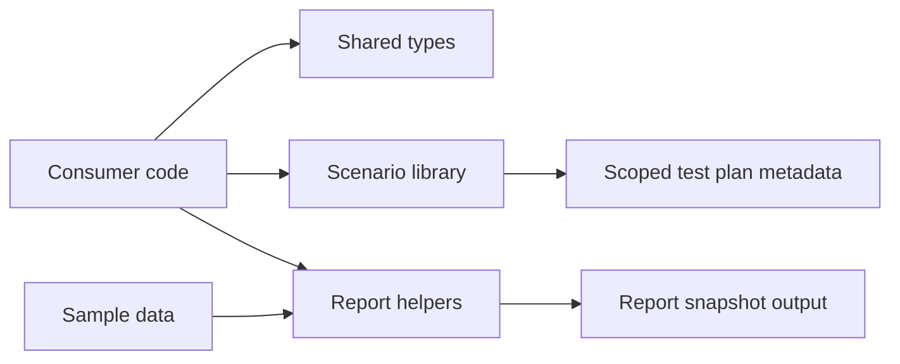

# Architecture

This public repository is intentionally small. It is the shared core, not the full platform.

## Public layers

### Shared types

The type layer defines the vocabulary for providers, claimed features, scenario outcomes, findings, and report snapshots.

### Scenario library

The scenario layer encodes reusable identity rollout checks and the feature coverage each scenario requires.

### Report helpers

The report layer computes readiness scores, publication assessments, executive summaries, and Markdown output from a report snapshot.

### Sample data

The sample-data layer gives downstream consumers a fake snapshot they can use for demos, tests, and documentation.

## What sits outside this repo

The full product has additional layers that are intentionally not published here:

- hosted workflows
- operator and customer interfaces
- evidence handling
- async orchestration
- notification delivery
- private provider integrations
- commercial operations
